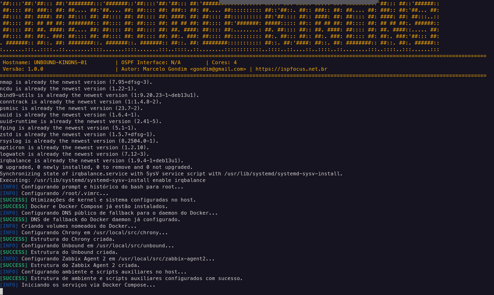

# Containerized Deployment - Recursive DNS (Unbound, FRR, Chrony, Zabbix Agent 2)



This repository contains the tools for deploying a Recursive DNS server (ISP Production Grade) using Docker and Docker Compose, optimizing performance, isolation, and ease of binary updates without compromising host state.

---

## Deployment Structure

The script installs and configures the structure in `/usr/local/src/` with the following structure:

```text
/usr/local/src/
├── chrony/
│   ├── docker-compose.yml
│   ├── Dockerfile
│   ├── chrony.conf
│   ├── sources.d/
│   │   └── nic.sources
│   └── conf.d/
│       └── ntp_acl.conf
├── frr/
│   ├── docker-compose.yml
│   ├── daemons
│   ├── frr.conf
│   └── vtysh.conf
├── zabbix-agent2/
│   ├── docker-compose.yml
│   └── zabbix_agent2.conf
└── unbound/
    ├── docker-compose.yml
    ├── Dockerfile
    ├── unbound.conf
    └── unbound.conf.d/
        ├── local.conf
        └── controle-acesso.conf
```

---

## Components and Host Network Optimizations

All containers run under network mode `network_mode: host` to listen directly on the physical interfaces and manipulate host kernel routes without NAT or bridging overhead.

*   **Unbound (Custom Compiled)**: Dockerfile with multi-stage compilation based on `alpine:latest` natively compiling the latest stable version of Unbound from NLnet Labs official source code.
    *   **Active Features**: DoH (`libnghttp2`), DoT/DNSSEC (`libssl`), multithreading, socket optimization (`libevent`), subnet (ECS), `dnstap`, `cachedb` (Redis), `python` module, and TCP Fast Open.
    *   **Capabilities**: `cap_add: [NET_ADMIN]` to optimize receive/send buffers (`so-rcvbuf` / `so-sndbuf`).
*   **FRRouting (OSPF Routing)**: Ospf v2/v3 enabled natively to announce DNS Anycast loopbacks.
    *   **Capabilities**: `cap_add: [NET_ADMIN, NET_RAW, SYS_ADMIN]`.
*   **Chrony (NTP)**: Robust time synchronization pointed to the `ntp.br` pool.
    *   **Capabilities**: `cap_add: [SYS_TIME]`.

---

## System Optimizations Applied on the Host

In addition to the containers, the installer configures and optimizes the Debian Host server to guarantee maximum performance at network/concurrency level:

1.  **Network and Kernel Parameters (`sysctl`)**:
    *   Network queue and buffers expanded to 16MB (`net.core.rmem_max`/`wmem_max`).
    *   Activation of **TCP BBR** congestion control and **FQ** packet scheduler.
    *   Native IPv4/IPv6 packet routing enablement (`forwarding=1`) for FRR OSPF.
    *   Netfilter/conntrack limit optimizations (`8,000,000` connections).
2.  **System Limits (`ulimits`)**:
    *   Simultaneous open files (`nofile`) raised to `65,536` for users and root.
3.  **Disabling Transparent Huge Pages (THP)**:
    *   Creation and activation of the `disable-thp.service` on the host to avoid latency in memory cache accesses.
4.  **IRQBalance and Utilities**:
    *   Installation and activation of `irqbalance` on the host to distribute network card processing among CPU cores.
    *   Installation of utilities like `grc`, `dnstop`, `tcpdump`, `expect`, and `logwatch`.
5.  **Grub Tuning (Disabling Security for Performance)**:
    *   **`APPARMOR="0"`**: Default disablement of AppArmor to avoid profile conflicts with Docker volumes and networks.
    *   **`MITIGATIONS="off"`**: Default disablement of CPU silicon mitigations (direct processing gain).

---

## How to Install and Run

1.  Access the script and customize the variables at the top if necessary (`APPARMOR`, `MITIGATIONS`).
2.  Run the installer passing the server **Hostname** as a required argument:

```bash
sudo ./unbound_kindns.sh <HOSTNAME>
```

*Note: Rebooting the server after installation will be required only for the Grub flags (AppArmor and Mitigations) and new sysctl changes to take full effect.*

---

## How to Alter Configurations and Restart Containers

All configuration changes must be made in the mapped host files. O installer will **never** overwrite custom configuration files that already exist in directories.

### 1. Unbound
*   **Files**: `/var/lib/docker/volumes/unbound_config/_data/unbound.conf` and subdirectories `/unbound.conf.d/`.
*   **How to check syntax without taking down the service**:
    ```bash
    docker exec -it unbound unbound-checkconf /etc/unbound/unbound.conf
    ```
*   **How to reload configurations keeping cache in memory**:
    ```bash
    docker exec -it unbound unbound-control reload_keep_cache
    ```
*   **How to restart completely**:
    ```bash
    cd /usr/local/src/unbound && docker compose restart unbound
    ```

### 2. FRRouting (FRR)
*   **Files**: `/var/lib/docker/volumes/frr_config/_data/frr.conf` and `/var/lib/docker/volumes/frr_config/_data/daemons`.
*   **How to change dynamically via vtysh console (recommended)**:
    ```bash
    docker exec -it frr vtysh
    # Make changes...
    frr-host# write memory (or wr)
    ```
    *Note: Thanks to chown `92:92` and permissions `750/640` applied to the folder, the `wr` command will persist changes directly on the host.*
*   **How to restart completely**:
    ```bash
    cd /usr/local/src/frr && docker compose restart frr
    ```

### 3. Chrony (NTP)
*   **Files**: `/var/lib/docker/volumes/chrony_config/_data/chrony.conf` and directories under `/conf.d/` and `/sources.d/`.
*   **How to restart after changes**:
    ```bash
    cd /usr/local/src/chrony && docker compose restart chrony
    ```

### 4. Zabbix Agent 2
*   **Files**: `/var/lib/docker/volumes/zabbix_agent2_config/_data/zabbix_agent2.conf`.
*   **How to restart after changes**:
    ```bash
    cd /usr/local/src/zabbix-agent2 && docker compose restart zabbix-agent2
    ```

---

## Updating the System (Individual Upgrades)

If you need to update the Docker image of a service, compile the latest code version, or reapply host environment variables independently (without running the main installer script completely), use the following commands in each service directory:

### 1. Unbound (DNS Resolver)
Since the Unbound image is compiled locally and configured to fetch the latest stable version from NLnet Labs, force recompilation by running:
```bash
cd /usr/local/src/unbound
docker compose down
docker compose up -d --build
```

### 2. Zabbix Agent 2
To get the latest official stable version from the registry or apply new IP/Hostname variables modified in `/etc/environment` on the host:
```bash
cd /usr/local/src/zabbix-agent2
docker compose pull             # Optional: downloads the latest official image
docker compose down
docker compose up -d            # Recreates the container injecting env_file variables
```

### 3. FRRouting (FRR / OSPF)
To get the latest official stable version from the registry and update the service:
```bash
cd /usr/local/src/frr
docker compose pull             # Optional: downloads the latest official image
docker compose down
docker compose up -d
```

### 4. Chrony
Since it has a local Dockerfile compiled in a custom way over Alpine:
```bash
cd /usr/local/src/chrony
docker compose down
docker compose up -d --build
```

---

## Validation and Service Query Examples

### 1. Test local queries and recursion on Unbound (IPv4 and IPv6)
```bash
# Standard local query
dig @127.0.0.1 google.com

# Local query using IPv6 loopback
dig @::1 google.com

# Inspect flags and active compiled modules in Alpine
docker exec -it unbound unbound -V

# View real-time logs
tail -f /var/log/unbound/unbound.log
```

### 2. Query OSPF routing in FRR
```bash
# Show active OSPFv2 (IPv4) neighbors
docker exec -it frr vtysh -c "show ip ospf neighbor"

# Show active OSPFv3 (IPv6) neighbors
docker exec -it frr vtysh -c "show ipv6 ospf6 neighbor"

# Show routes learned via OSPF
docker exec -it frr vtysh -c "show ip route ospf"
```

### 3. Query time sync in Chrony
```bash
# Clock synchronization status
docker exec -it chrony chronyc tracking

# Active NTP servers and sources
docker exec -it chrony chronyc sources -v
```

### 4. Validate Zabbix Agent 2 locally
```bash
# Test the agent directly from inside the container
docker exec -it zabbix-agent2 zabbix_agent2 -t agent.ping

# Verify if port 10050 is open/listening on the host using netcat
nc -zv 127.0.0.1 10050
nc -zv ::1 10050
```

---

## Troubleshooting (Common Issues Resolutions)

### 1. DNS Errors / Name Resolution during `docker build` (transient error)
*   **Symptom**: When compiling images (like `unbound`), the following error occurs:
    `WARNING: fetching https://.../APKINDEX.tar.gz: DNS: transient error (try again later)`
*   **Cause**: The Debian host uses local recursive DNS (`127.0.0.1`). The Docker Builder inherits this resolv.conf and attempts to fetch DNS inside the container on its own internal loopback, where nothing responds.
*   **Resolution**: The deployment script automatically generates the `/etc/docker/daemon.json` file pointing to public fallback DNS (`1.1.1.1`, `8.8.8.8`). Make sure the docker daemon was restarted:
    ```bash
    sudo systemctl restart docker
    ```

### 2. Failure in `write memory` (`wr`) command of FRR (vtysh)
*   **Symptom**: When saving route configurations inside vtysh (`wr`), permission denied error occurs.
*   **Cause**: Folder configuration permissions on the host belong to an incorrect user.
*   **Resolution**: Re-establish appropriate permissions on the host (owner `92:92` corresponding to the UID/GID of the internal `frr` user in the container):
    ```bash
    sudo chown -R 92:92 /var/lib/docker/volumes/frr_config/_data
    sudo chmod 750 /var/lib/docker/volumes/frr_config/_data
    sudo chmod 640 /var/lib/docker/volumes/frr_config/_data/*
    ```

### 3. Permission Denied on Unbound logs
*   **Symptom**: Unbound does not start and displays `Permission denied` when trying to open `/var/log/unbound/unbound.log`.
*   **Cause**: The owner of the log folder/file on the host does not match the UID of the internal `unbound` user in Alpine (UID `88`).
*   **Resolution**: Adjust ownership on the host:
    ```bash
    sudo chown -R 88:88 /var/log/unbound
    sudo chmod 750 /var/log/unbound
    sudo chmod 640 /var/log/unbound/unbound.log
    ```
